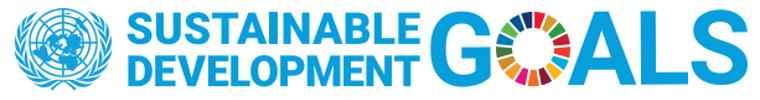
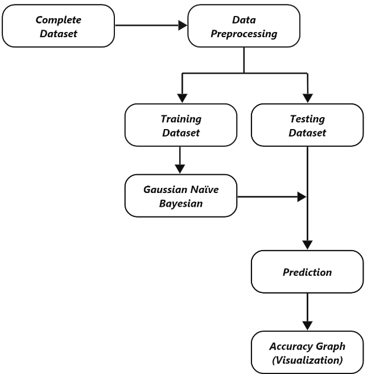
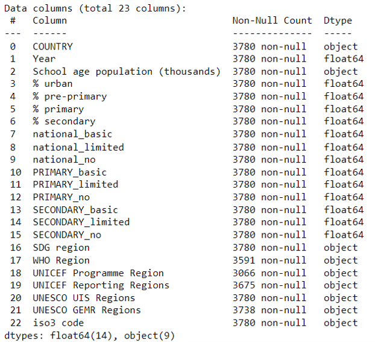
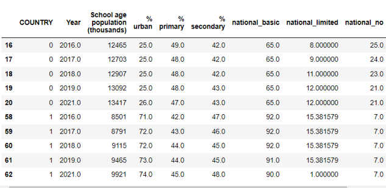
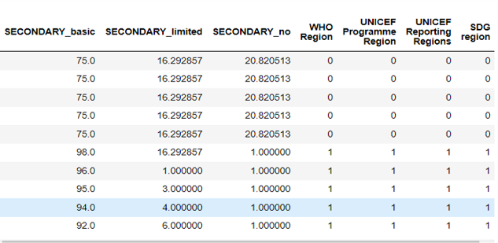
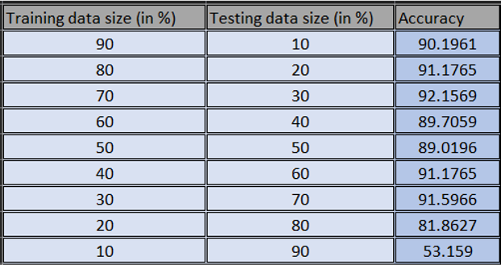
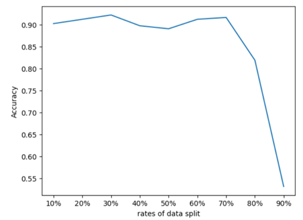

# Sustainable Development Goal (SDG) Region Prediction

## Abstract

- This project focuses on predicting Sustainable Development Goal (SDG) regions based on various factors, including countries, year, school levels, basic amenities, and other entities.
- The primary focus is on SDG-6th goal, which aims to ensure the availability and sustainable management of water and sanitation for all nations.
- The project utilizes the Naive Bayes classification algorithm, specifically Gaussian Naive Bayes, to predict the availability and sustainable management of water and sanitation.
- The study uses a secondary dataset collected from United Nations International Children’s Emergency Fund (UNICEF) and the World Health Organization (WHO) repositories.
- The proposed work achieved the highest accuracy rate of 92.15% using the Gaussian Naive Bayes classifier.

## Introduction

Access to safe and sustainable water and sanitation is a key global concern and is addressed in the United Nations’ Sustainable Development Goals (SDGs). This project employs the Naive Bayes classification algorithm to predict the likelihood of each input feature belonging to the 'SDG regions' class.

Three different Naive Bayes classifiers were tested, including Gaussian NB, Multinomial NB, and Bernoulli’s NB. Among these, the Gaussian Naive Bayes classifier achieved the highest accuracy rate of 92.15%.

## Literature Review

The literature review covers research studies that have utilized the Naive Bayes algorithm for various purposes, including water quality prediction, purchase prediction, healthcare diagnosis, human behavior impact analysis, food crop planting recommendation, academic performance classification, and spam comment classification. The studies aim to fill research gaps in their respective fields and demonstrate the effectiveness of the Naive Bayes algorithm. The accuracy of the Naive Bayes algorithm varied between 62.5% to 96.15%, depending on the dataset used and research objectives.

## Proposed Methodology

### Data Acquisition

The project utilizes a secondary dataset titled 'Drinking water, sanitation and hygiene in schools by country, 2000-2021,' collected from United Nations International Children’s Emergency Fund (UNICEF) and the World Health Organization (WHO) repositories.

### Pre-processing of Data

The initial dataset contained 3781 rows X 32 columns. Data preprocessing included the following steps:

- Removal of null values and irrelevant columns.
- Application of mean for essential columns containing null values.
- Limiting data to the years 2016 - 2021.
- Conversion of data from 'Object' type to numerical data using LabelEncoder and dictionaries.

#### Original Dataset

#### Filtered Dataset

### Proposed Algorithm (Implementation)

The project employed essential Python libraries, including pandas, numpy, sklearn, and matplotlib. Data was converted to numerical labels using the LabelEncoder library. The Gaussian Naive Bayes classifier was used for training the model, resulting in better accuracy.

### Mathematical Model

Bayes’ Theorem:  P(y|x) = P(x|y) ∗ P(y)/P(x)

- P(y | x) is the posterior probability of class y given the features x
- P(x | y) is the likelihood of observing features x given class y
- P(y) is the prior probability of class y
- P(x) is the probability of observing features x

### Experimental Result

- The highest accuracy of 92.15% was achieved at a 30% dataset size for testing.
- Promising accuracies were observed at 60%-70% dataset sizes due to even class distribution.
- The dataset includes 6 SDG regions.
- Evaluation metrics are represented in tabular and graphical forms.

### Conclusion

In conclusion:

- The Naive Bayes classification algorithm achieved an impressive accuracy rate of 92.15% on the SDG 6 dataset, demonstrating its effectiveness in predicting the availability and sustainable management of water and sanitation.

- It's worth noting that the model performed better when dealing with numeric data, necessitating the conversion of categorical data to numerical format during pre-processing.

- This project serves as a strong foundation for further research in this domain. Future work can focus on improving the model's accuracy even further and exploring alternative machine-learning approaches to predict the success of interventions aimed at achieving SDG 6.

Your contributions and ideas are welcome to enhance the project and drive progress toward sustainable development goals.
